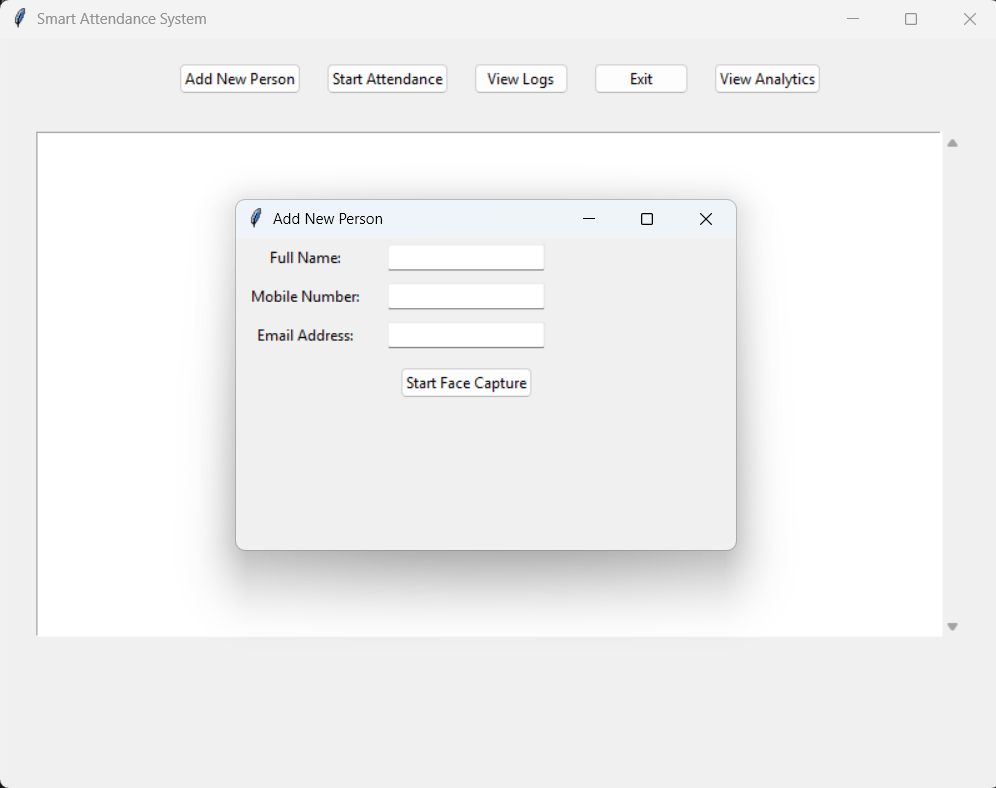
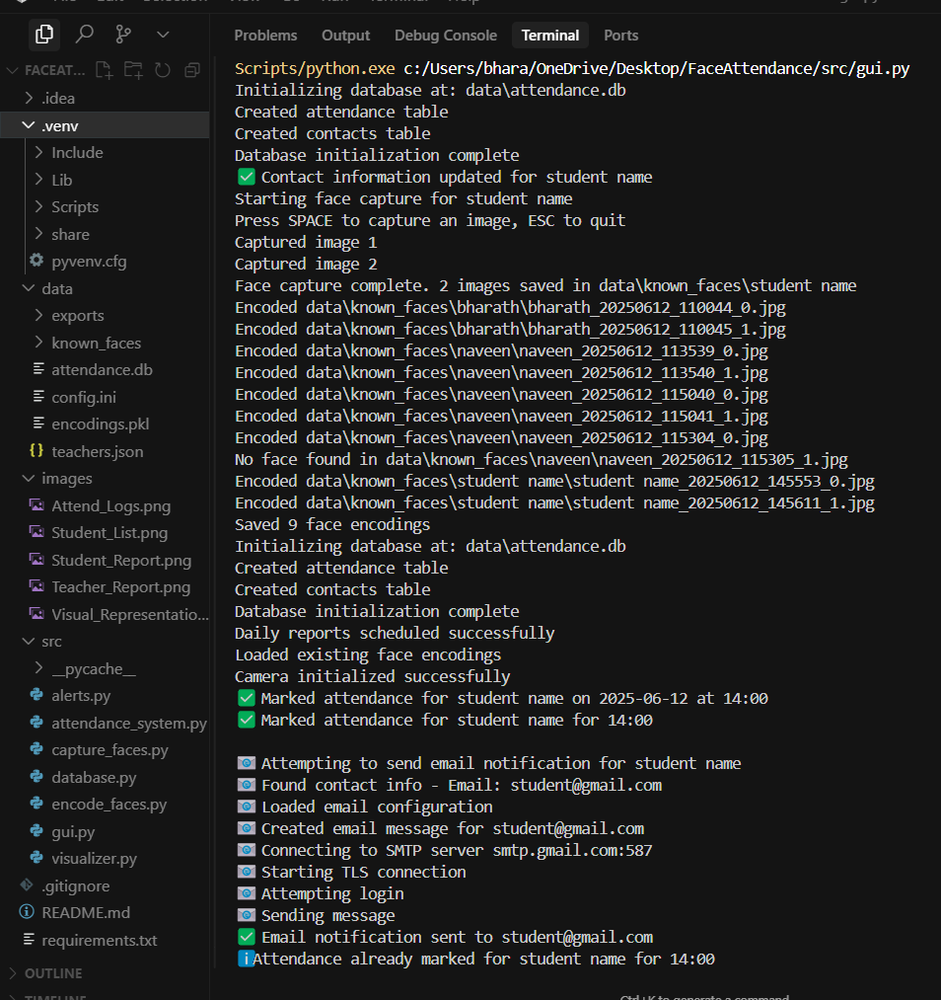
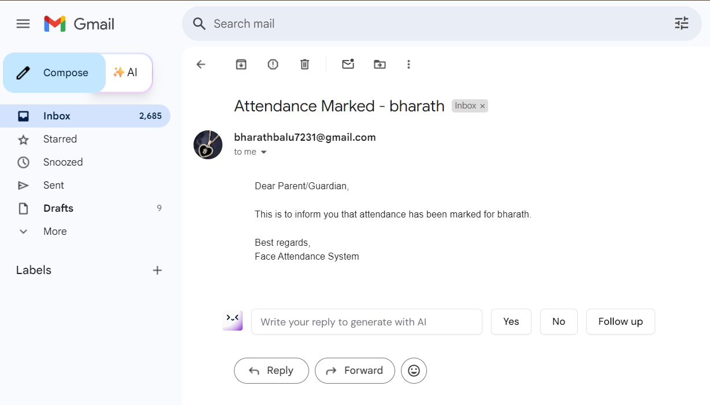
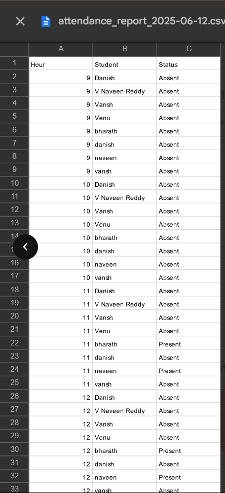
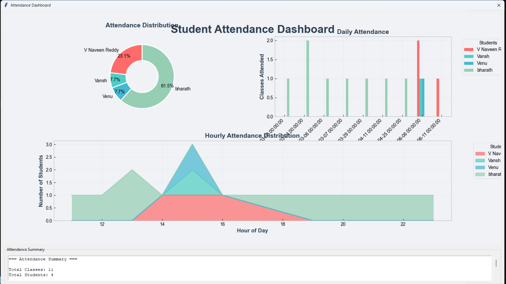
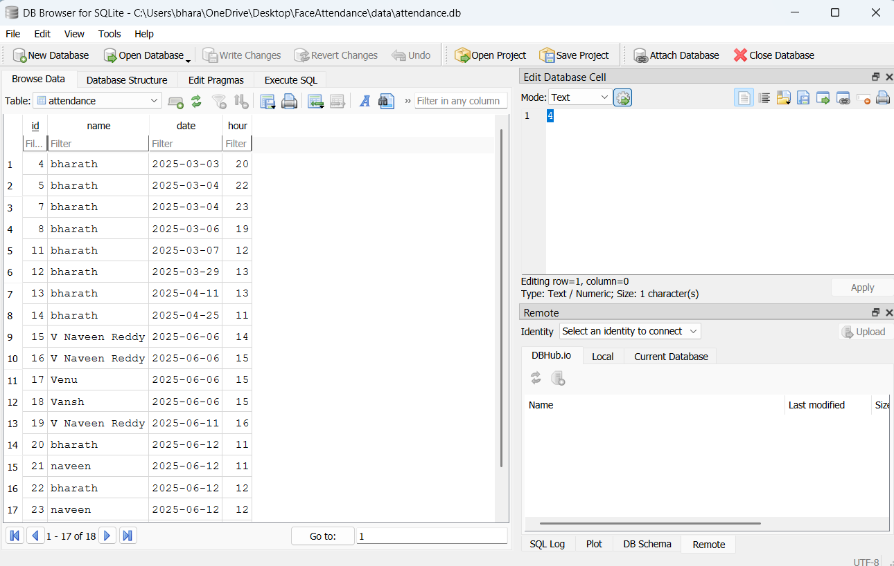

# 👤 Smart Attendance System
(Tailored for educational use cases with a modern edge.)

## 📝 Overview

Smart Attendance System is a Python-based application that automates student attendance using real-time face recognition. Built with OpenCV, Dlib, and Tkinter, the system captures and identifies faces via CCTVcam, logs attendance with timestamps, and sends email notifications to students&parents. It also generates daily teacher reports with visual analytics and CSV summaries. Designed for educational institutions, this solution enhances accuracy, saves time, and provides transparent reporting through an interactive dashboard and GUI.

## 📬 Email Notification Logic

| Condition         | Recipient     | Description                                |
|------------------|---------------|--------------------------------------------|
| ✅ Student Present | **Student**   | Email confirmation of attendance           |
| ❌ Student Absent  | **Parent**    | Absence alert sent daily                   |
| 📅 Daily Summary   | **Teacher**   | CSV + PNG report of absentees per hour     |


## 📁 Project Structure

```
FaceAttendance/
├── src/                      # Source code directory
│   ├── alerts.py            # 📧 Email notification system
│   ├── attendance_system.py # 📸 Main attendance marking system
│   ├── capture_faces.py     # 📷 Face capture utility
│   ├── database.py          # 💾 SQLite database operations
│   ├── encode_faces.py      # 🔐 Face encoding generation
│   ├── gui.py              # 🖥️ Tkinter GUI application
│   └── visualizer.py       # 📊 Attendance visualization and reporting
│
├── data/                     # Data directory
│   ├── attendance.db        # 💾 SQLite database
│   ├── config.ini           # ⚙️ Configuration settings
│   ├── encodings.pkl        # 🔐 Face encodings storage
│   ├── teachers.json        # 👨‍🏫 Teacher assignments
│   ├── known_faces/         # 📸 Directory for student face images
│   └── exports/            # 📤 Directory for generated reports
│
├── requirements.txt          # 📦 Project dependencies
├── README.md                # 📚 Project documentation
└── .gitignore              # 🚫 Git ignore file

```

### 🔑 Key Components

1. **Source Code (`src/`)**
   - `alerts.py`: 📧 Handles email notifications for absent students and daily teacher reports
   - `attendance_system.py`: 📸 Core system for marking attendance using face recognition
   - `capture_faces.py`: 📷 Utility for capturing and storing student face images
   - `database.py`: 💾 Manages SQLite database operations for attendance records
   - `encode_faces.py`: 🔐 Generates face encodings for recognition
   - `gui.py`: 🖥️ Tkinter-based GUI for system interaction
   - `visualizer.py`: 📊 Generates attendance reports and visualizations

2. **Data Directory (`data/`)**
   - `attendance.db`: 💾 SQLite database storing attendance records
   - `config.ini`: ⚙️ Configuration settings (email, paths, etc.)
   - `encodings.pkl`: 🔐 Stored face encodings for recognition
   - `teachers.json`: 👨‍🏫 Teacher assignments and schedules
   - `known_faces/`: 📸 Directory containing student face images
   - `exports/`: 📤 Directory for generated reports and visualizations

## 📦 Dependencies

- 🎯 dlib (for face detection and recognition)
- 📸 opencv-contrib-python (for webcam capture and image processing)
- 📊 pandas (for data handling and CSV generation)
- 📈 matplotlib (for generating summary charts)
- 🖼️ Pillow (for image processing)
- ⏰ schedule (for scheduling daily reports)
- 📧 smtplib (for sending emails)
- ⚙️ configparser (for reading configuration)

## 💻 System Requirements

### 🛠️ Software Requirements

1. **Operating System** 💻
   - Windows 10/11
   - Linux (Ubuntu 20.04 or later)
   - macOS (10.15 or later)

2. **Python Environment** 🐍
   - Python 3.8 or later
   - pip (Python package installer)
   - Virtual environment (recommended)

3. **Required Software** 🔧
   - Git (for version control)
   - CMake (required for dlib installation)
   - Visual Studio Build Tools (Windows only, for dlib compilation)
   - GCC/G++ (Linux/macOS, for dlib compilation)

4. **Email Service** 📧
   - SMTP server access (e.g., Gmail, Outlook)
   - Valid email credentials for notifications

### 🔧 Hardware Requirements

1. **Computer Specifications** 💻
   - CPU: Intel Core i5/AMD Ryzen 5 or better
   - RAM: 8GB minimum (16GB recommended)
   - Storage: 1GB free space minimum
   - Display: 1280x720 resolution minimum

2. **Camera Requirements** 📸
   - Webcam with minimum 720p resolution
   - Good lighting conditions
   - Camera should be positioned at face level
   - Minimum frame rate: 30 FPS
   - Auto-focus capability (recommended)

3. **Network Requirements** 🌐
   - Stable internet connection for email notifications
   - Minimum upload speed: 1 Mbps
   - Minimum download speed: 1 Mbps

### 📝 Additional Notes

1. **Performance Considerations** ⚡
   - Face recognition works best with good lighting
   - System performance may vary based on:
     - Number of registered students
     - Camera quality and positioning
     - Computer specifications
     - Network speed (for email notifications)

2. **Installation Notes** 📋
   - dlib installation might require additional system dependencies
   - On Windows, Visual Studio Build Tools are necessary
   - On Linux, GCC/G++ and CMake are required
   - On macOS, Xcode Command Line Tools are needed

## 🚀 Installation

1. Clone the repository (or download the project folder).
2. (Optional) Create a virtual environment (e.g. using venv or conda) and activate it.
3. Install the dependencies (for example, run the following in your terminal):

   ```bash
   pip install dlib opencv-contrib-python pandas matplotlib Pillow schedule
   ```
   (Note: dlib may require additional build tools (e.g. CMake) depending on your OS.)

4. Configure your email settings (and teacher assignments) in the configuration files (e.g. update `data/config.ini` and `data/teachers.json`).

## 💡 Usage

- **GUI (Add Students / View Analytics)** 🖥️  
  Run the GUI (for example, via the command below) to add new students (and capture their faces) or view attendance analytics.

  ```bash
  python src/gui.py
  ```

- **Attendance System (Mark Attendance / Send Reports)** 📸  
  Run the attendance system (for example, via the command below) to start marking attendance (and sending notifications and daily teacher reports).

  ```bash
  python src/attendance_system.py
  ```

## 📸 Screenshots

### 🖥️ Main GUI Interface

*Main application window showing attendance marking interface*

### 👤 Edu_Tracker_Progress

*Edu_track process with real-time detection*

### 📊 Student Report(Mail)

*Attendance confirmation mail send to student*

### 📧 Teachers Report(Mail)

*Sample email notification sent to Teacher*

### 📈 Report List

*Daily teacher report with attendance summary and student list*

### 📈 Visual Representation

*representation of attendance percentages*

### 📈 DataBase Log

*Database records of students data*

## ⚙️ Configuration

- **Email Settings** 📧  
  Update your SMTP (e.g. Gmail) settings in `data/config.ini`.

- **Teacher Assignments** 👨‍🏫  
  Update (or create) `data/teachers.json` (or equivalent) to assign teachers (and their assigned hours) for daily reports.

## 📝 Notes

- The teacher report (sent daily) now includes a CSV file (with absent students for the current day) and a PNG summary chart.
